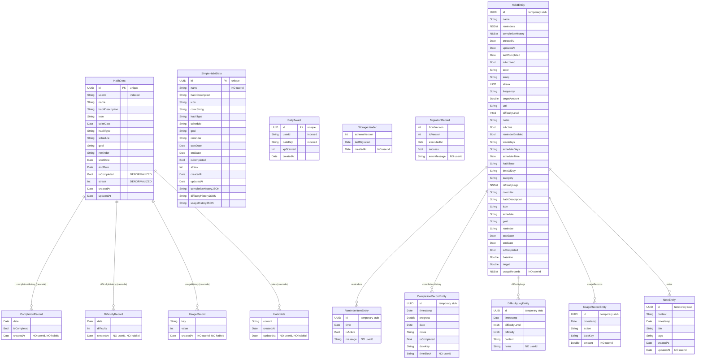

# Entity Relationship Diagram - From Actual Code

## Mermaid ER Diagram

## Relationship Analysis

### Defined Relationships (Working)
1. **HabitData → CompletionRecord** (1:many, cascade delete)
2. **HabitData → DifficultyRecord** (1:many, cascade delete)  
3. **HabitData → UsageRecord** (1:many, cascade delete)
4. **HabitData → HabitNote** (1:many, cascade delete)

### Missing Relationships (Issues)
1. **DailyAward → HabitData** - No relationship defined
2. **CompletionRecord → HabitData** - No inverse relationship
3. **DifficultyRecord → HabitData** - No inverse relationship
4. **UsageRecord → HabitData** - No inverse relationship
5. **HabitNote → HabitData** - No inverse relationship

### User Scoping Issues
- **DailyAward**: ✅ Has `userId`
- **HabitData**: ✅ Has `userId`
- **All other SwiftData models**: ❌ Missing `userId`
- **All Core Data models**: ❌ Missing `userId`

### Denormalized Fields
- **HabitData.isCompleted**: ⚠️ DENORMALIZED - should be computed from CompletionRecord
- **HabitData.streak**: ⚠️ DENORMALIZED - should be computed from CompletionRecord

### Indexing Issues
- **userId** should be indexed on all models for efficient user-scoped queries
- **dateKey** should be indexed on DailyAward for efficient date-based queries
- **habitId** should be added to CompletionRecord, DifficultyRecord, UsageRecord, HabitNote for efficient habit-based queries

## Critical Problems

1. **No User Isolation**: Most models lack `userId`, allowing data leakage between users
2. **Broken Relationships**: Related models have no back-references, making queries inefficient
3. **Denormalized Data**: `isCompleted` and `streak` can become inconsistent
4. **Missing Foreign Keys**: DailyAward cannot track which habits contributed to XP
5. **Dual Storage**: Both SwiftData and CoreData models exist, creating confusion
