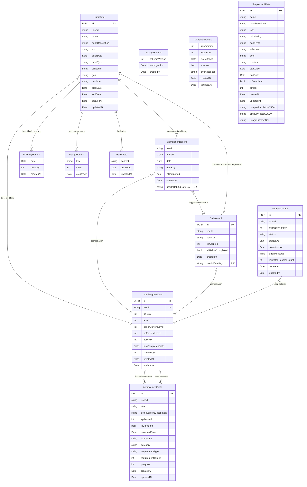

# Entity Relationship Diagram

This document provides a Mermaid ER diagram showing the relationships between all persisted models in the Habitto codebase.

## ER Diagram



## Relationship Details

### Primary Relationships (1:N)

1. **HabitData → CompletionRecord** (1:N)
   - **Type:** One-to-Many
   - **Delete Rule:** Cascade
   - **Purpose:** Track daily completion status for each habit
   - **Key:** `HabitData.id` → `CompletionRecord.habitId`

2. **HabitData → DifficultyRecord** (1:N)
   - **Type:** One-to-Many
   - **Delete Rule:** Cascade
   - **Purpose:** Track daily difficulty ratings
   - **Key:** `HabitData.id` → `DifficultyRecord.habitId` (implied)

3. **HabitData → UsageRecord** (1:N)
   - **Type:** One-to-Many
   - **Delete Rule:** Cascade
   - **Purpose:** Track usage metrics for habit breaking
   - **Key:** `HabitData.id` → `UsageRecord.habitId` (implied)

4. **HabitData → HabitNote** (1:N)
   - **Type:** One-to-Many
   - **Delete Rule:** Cascade
   - **Purpose:** Associate notes with habits
   - **Key:** `HabitData.id` → `HabitNote.habitId` (implied)

5. **UserProgressData → AchievementData** (1:N)
   - **Type:** One-to-Many
   - **Delete Rule:** Cascade
   - **Purpose:** Track user achievements and progress
   - **Key:** `UserProgressData.userId` → `AchievementData.userId`

### User Isolation Relationships (1:1)

All models are scoped by `userId` for user data isolation:

6. **UserProgressData** (1:1 per user)
   - **Constraint:** `@Attribute(.unique) var userId: String`
   - **Purpose:** Single progress record per user

### Business Logic Relationships (Implicit)

7. **DailyAward ↔ CompletionRecord** (Implicit)
   - **Purpose:** Daily awards are granted when all habits are completed
   - **Logic:** Service-level relationship, not direct foreign key

8. **DailyAward ↔ UserProgressData** (Implicit)
   - **Purpose:** Daily awards contribute to user XP and level progression
   - **Logic:** Service-level relationship, not direct foreign key

## Key Constraints and Indexes

### Primary Keys
- All models have `id: UUID` with `@Attribute(.unique)`

### Unique Constraints
1. **CompletionRecord.userIdHabitIdDateKey**
   - **Purpose:** Prevent duplicate completions per habit per day
   - **Format:** `"userId#habitId#dateKey"`

2. **DailyAward.userIdDateKey**
   - **Purpose:** Prevent duplicate daily awards per user per day
   - **Format:** `"userId#dateKey"`

3. **UserProgressData.userId**
   - **Purpose:** Ensure one progress record per user
   - **Type:** Single field unique constraint

### Indexing Notes
- SwiftData limitations prevent explicit indexing on `userId` fields
- Composite unique constraints provide implicit indexing
- Date-based queries use `dateKey` strings for performance

## Data Flow Summary

```
User → UserProgressData (1:1)
  ↓
User → HabitData[] (1:N)
  ↓
HabitData → CompletionRecord[] (1:N)
  ↓
CompletionRecord[] → DailyAward (business logic)
  ↓
DailyAward → UserProgressData.xpTotal (service update)
```

## Migration and Legacy Models

- **MigrationState:** Tracks migration status per user
- **MigrationRecord:** Logs migration execution history
- **StorageHeader:** Schema versioning
- **SimpleHabitData:** Legacy storage (deprecated)
- **DifficultyRecord, UsageRecord, HabitNote:** Legacy models with limited functionality